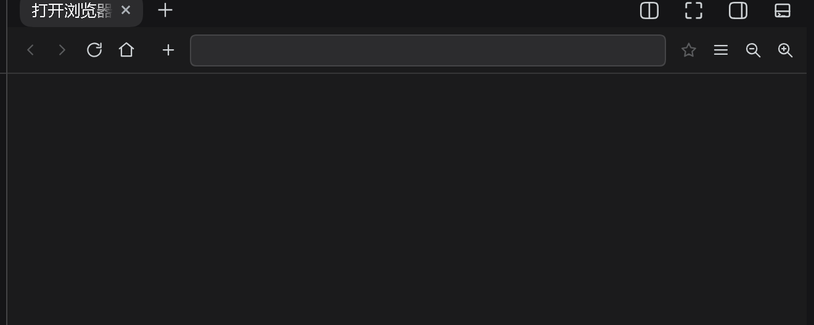

# dsh-embedded-browser

> 本仓**只有 vk 版**：位置 —— 右栏标签（`sidebar.right.pane.tab`），需先装 [dsh-vk-suite](https://github.com/Ln1m/dsh-vk-suite) 契约 + 骨架。
> 冲突：一个槽位只渲染优先级最高的一条，同优先级重复注册会直接抛错；与占同一位置的插件互斥（详见 [dsh-vk-suite](https://github.com/Ln1m/dsh-vk-suite) 的「推荐怎么用 / 会跟谁冲突」）。

[English](README.en.md) · 中文



*界面实拍：截自本机运行中的 DSH 实例，示例内容已脱敏。*

在右栏开一个真浏览器。面板只负责工具条和矩形上报，画面是 DSH 桌面外壳（`dsh-desktop`，WinForms + WebView2）主窗体里的一块 WebView2 原生子控件——真视图，不是截图仿制品。

## 两半

| 半 | 位置 | 职责 |
|---|---|---|
| 面板（插件） | `lib/index.js` + `lib/client.js` | 在右栏注册「打开浏览器」标签、自绘工具条、上报面板矩形、标签条 / 地址框 / 收藏夹的前端逻辑 |
| 外壳 | `src/App.cs` | 主窗体里 `Controls.Add` 一块 WebView2 子控件；多标签 = 多块子控件，共用一份 `CoreWebView2Environment` |

## 行为

- 多标签共用同一个浏览器进程与 9223 调试口（9222 留给 DSH 主界面），同一时刻只有当前标签可见
- `target=_blank` / `window.open` 直接在标签条里多开一个标签，上限 8 个
- 收藏夹是外壳单独的一块小 WebView2 浮层，叠在画面上，点画面 / 主界面失焦 / Esc 收起
- 面板挂载时先发 `{cmd:'shelf', probe:true}` 探测；收到 ack 才走浮层，否则退回面板内的 DOM 小卡片（兼容旧外壳）

## 面板 ↔ 外壳协议

面板 → 外壳：

| cmd | 作用 |
|---|---|
| `open` / `rect` / `hide` | 把视图摆上来、跟随面板矩形、收起 |
| `nav` | 导航当前标签 |
| `newTab` / `closeTab` / `selectTab` | 标签管理 |
| `shelf` | 收藏夹浮层 |

外壳 → 面板：`{kind:'dsh-embed-state', …}` 与 `{kind:'dsh-embed-shelf', ack|url|closed}`。

面板矩形上报走前沿节流（30ms 前沿 + 后沿），拖右栏时画面跟手，不做防抖。

## 装

```sh
dsh plugin --profile web add file:<本仓库>
```

画面那半要桌面外壳：`build.ps1` 用 `csc` 把 `src\App.cs` 编成 `dsh-desktop.exe`（WebView2 的 DLL 放同目录，或留 `build\packages`）。

## 前提

- Windows + WebView2 Runtime
- `lib/client.js` 与外壳 exe 必须成对更新——协议两边要对得上
